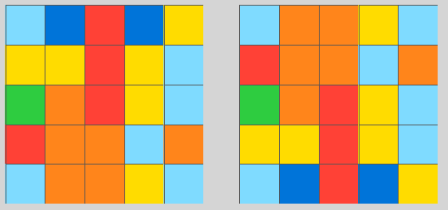

# The Abstraction and Reasoning Corpus (ARC)

This repository contains the ARC task data, as well as a browser-based interface for humans to try their hand at solving the tasks manually.

*"ARC can be seen as a general artificial intelligence benchmark, as a program synthesis benchmark, or as a psychometric intelligence test. It is targeted at both humans and artificially intelligent systems that aim at emulating a human-like form of general fluid intelligence."*

A complete description of the dataset, its goals, and its underlying logic, can be found in: [The Measure of Intelligence](https://arxiv.org/abs/1911.01547).

As a reminder, a test-taker is said to solve a task when, upon seeing the task for the first time, they are able to produce the correct output grid for *all* test inputs in the task (this includes picking the dimensions of the output grid). For each test input, the test-taker is allowed 3 trials (this holds for all test-takers, either humans or AI).

## Task file format

The `data` directory contains two subdirectories:

- `data/training`: contains the task files for training (400 tasks). Use these to prototype your algorithm or to train your algorithm to acquire ARC-relevant cognitive priors.
- `data/evaluation`: contains the task files for evaluation (400 tasks). Use these to evaluate your final algorithm. To ensure fair evaluation results, do not leak information from the evaluation set into your algorithm (e.g. by looking at the evaluation tasks yourself during development, or by repeatedly modifying an algorithm while using its evaluation score as feedback).

The tasks are stored in JSON format. Each task JSON file contains a dictionary with two fields:

- `"train"`: demonstration input/output pairs. It is a list of "pairs" (typically 3 pairs).
- `"test"`: test input/output pairs. It is a list of "pairs" (typically 1 pair).

A "pair" is a dictionary with two fields:

- `"input"`: the input "grid" for the pair.
- `"output"`: the output "grid" for the pair.

A "grid" is a rectangular matrix (list of lists) of integers between 0 and 9 (inclusive). The smallest possible grid size is 1x1 and the largest is 30x30.

When looking at a task, a test-taker has access to inputs & outputs of the demonstration pairs, plus the input(s) of the test pair(s). The goal is to construct the output grid(s) corresponding to the test input grid(s), using 3 trials for each test input. "Constructing the output grid" involves picking the height and width of the output grid, then filling each cell in the grid with a symbol (integer between 0 and 9, which are visualized as colors). Only *exact* solutions (all cells match the expected answer) can be said to be correct.

## Usage of the testing interface

The testing interface is located at `apps/testing_interface.html`. Open it in a web browser (Chrome recommended). It will prompt you to select a task JSON file.

After loading a task, you will enter the test space, which looks like this:

On the left, you will see the input/output pairs demonstrating the nature of the task. In the middle, you will see the current test input grid. On the right, you will see the controls you can use to construct the corresponding output grid.

You have access to the following tools:

### Grid controls

- Resize: input a grid size (e.g. "10x20" or "4x4") and click "Resize". This preserves existing grid content (in the top left corner).
- Copy from input: copy the input grid to the output grid. This is useful for tasks where the output consists of some modification of the input.
- Reset grid: fill the grid with 0s.

### Symbol controls

- Edit: select a color (symbol) from the color picking bar, then click on a cell to set its color.
- Select: click and drag on either the output grid or the input grid to select cells.
    - After selecting cells on the output grid, you can select a color from the color picking to set the color of the selected cells. This is useful to draw solid rectangles or lines.
    - After selecting cells on either the input grid or the output grid, you can press C to copy their content. After copying, you can select a cell on the output grid and press "V" to paste the copied content. You should select the cell in the top left corner of the zone you want to paste into.
- Floodfill: click on a cell from the output grid to color all connected cells to the selected color. "Connected cells" are contiguous cells with the same color.

### Answer validation

When your output grid is ready, click the green "Submit!" button to check your answer. We do not enforce the 3-trials rule.

After you've obtained the correct answer for the current test input grid, you can switch to the next test input grid for the task using the "Next test input" button (if there is any available; most tasks only have one test input).

When you're done with a task, use the "load task" button to open a new task.

## Manual Solutions
Manual hand-coded solutions for few tasks are available in `src/manual_solve.py` script.  
The manual solutions are available for following 9 tasks (ordered by their difficulty) :  
- 83302e8f
- 22233c11
- dc0a314f
- 6855a6e4
- 68b16354
- af902bf9
- 794b24be
- de1cd16c
- 0a938d79

### Description of tasks
#### 83302e8f
For this task, we are given a square grid with multiple squares (colour black)
of equal dimension in it. The number of such square and their position
are deterministic, for a given grid. The squares share boundary between
each other (main colour of it being blue) and one or more blocks in the
boundary can have same colour as square (black). Our task is to modify
the grid in such a way that the squares that are connected with other
square(s) are coloured with yellow and isolated ones are coloured with green.
The colour of black connecting blocks in the boundary is also changed to yellow  

#### 22233c11
For this task, we are given a square grid with patterns
having two green squares connected via either principal
or secondary diagonals of the matrices. There can be multiple
such patterns in the grid. For each such pattern identified,
we have to add two blue squares of same size to their neighbourhood.
Positions of these blue squares will depend on the following :  
1. Positions of the green squares  
2. Whether green squares are connected via principal or secondary
   diagonal  
The positions for blue squares can be determined once we identify
the above two. Finally, these two squares are marked as blue.

#### dc0a314f
Given an array, we must find what values should be put into a square with green colours(3). The whole array
seems to be symmetric and the values taken up by the green points should be replaced by the other elements 
present in the array.

#### 6855a6e4
For this task, we are given a square grid with two red shaped and
two grey shaped items in it. The items/figures with red colour have
square bracket shape ( [ or ] ) and they appear either horizontally
or vertically in an enclosing manner (eg. [ ] for vertical). The
grey shapes occur outside the red shapes and their positions can be
determined. Our task is to find the grey figures, flip them horizontally
or vertically based on alignment of red shape, and then move them from
outside to inside blocks of red enclosing brackets.

#### af902bf9
There is an array given with multiple non-zero corner points of a square. The objective is to find
these squares and fill all the elements with red colour (2) except the rows and columns containing 
the corner of the squares.

#### 0a938d79
The initial stage of the task contains two non-zero elements in the given array.The problem to solve
here is then identifying the rows or columns they are situated in and expanding it to the whole row/columns
depending on the dimensions of the array.The same must be done to equidistant rows/columns starting
from the non-zero elements to the end of the array. The aforementioned distance is the space
between the non-zero elements.

#### de1cd16c
There is an array given with multiple values as elements. Some of these have quadrilateral shaped 
areas in the array where they are present in the majority. The one in minority is one of these other
values. This pattern(a colour dominating other in a quadrilateral) is repeated with other values too.
The task here is to find the colour/value of the area where there are most number of these 'minority'
values in comparison to others.

#### 794b24be
For this task, we are given a square grid (as Numpy array)
with few blocks filled with blue colour. Our task is to take
upper-right half triangle of the grid, fill k blocks with red
colour by going row-wise from left, where k is the count of
blocks with blue colour in the original grid. All the blue blocks
in original grid are set to black as well.

#### 68b16354
There is an array given with multiple non-zero values. The task here is to create the array which
closely resembles the input array.

